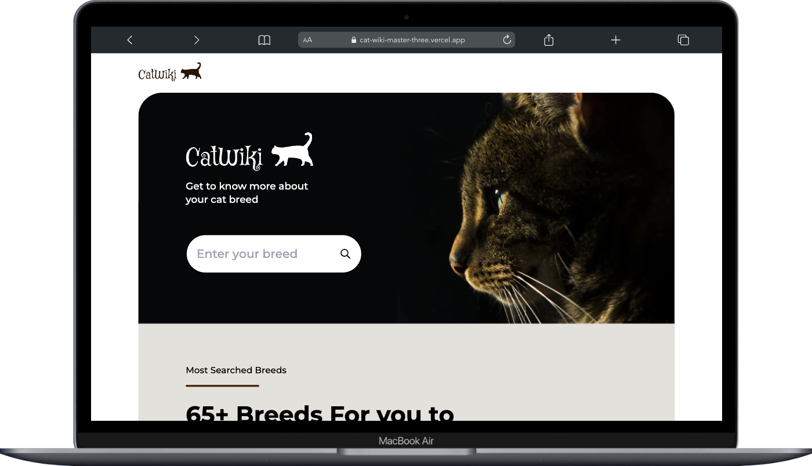
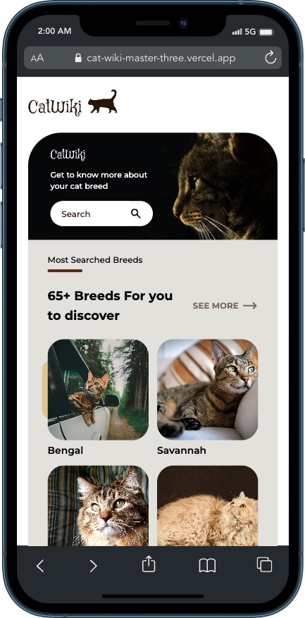

<!-- Please update value in the {}  -->

<h1 align="center">CatWiki</h1>

   Solution for a challenge from  <a href="http://devchallenges.io" target="_blank">Devchallenges.io</a>.

  <h3>
    <a href="https://cat-wiki-master-three.vercel.app/">
      Demo
    </a>
     | 
    <a href="https://github.com/oudajosefu/cat-wiki-master">
      Solution
    </a>
     | 
    <a href="https://devchallenges.io/challenges/f4NJ53rcfgrP6sBMD2jt">
      Challenge
    </a>
  </h3>

<!-- TABLE OF CONTENTS -->

## Table of Contents

-   [Overview](#overview)
    -   [Built With](#built-with)
-   [Features](#features)
-   [Contact](#contact)

<!-- OVERVIEW -->

## Overview

-   What was your experience?
    -   This was a really annoying project to build due to all the intricacies of the responsive design. Some problems came about when I tried to develop the search modal using Headless UI. I had to take some time to wrap my head around how modal styling actually works under the hood.
-   What have you learned/improved?
    -   I learned how to properly style modals and search input boxes. Headless UI provides a combobox component that allows for autocompletion as you type so I added it as a search bar instead that would link to the specific cat breed's page whenever the combobox option was clicked.

### Built With

<!-- This section should list any major frameworks that you built your project using. Here are a few examples.-->

-   [React](https://reactjs.org/)
-   [Next.js](https://nextjs.org/)
-   [Tailwind](https://tailwindcss.com/)
-   [Headless UI](https://headlessui.com/)

## Features

<!-- List the features of your application or follow the template. Don't share the figma file here :) -->

This application/site was created as a submission to a [DevChallenges](https://devchallenges.io/challenges) challenge. The [challenge](https://devchallenges.io/challenges/f4NJ53rcfgrP6sBMD2jt) was to build an application to complete the given user stories.

## Contact

-   GitHub [@oudajosefu](https://github.com/oudajosefu)
-   Twitter [@oudajosefu](https://twitter.com/oudajosefu)
